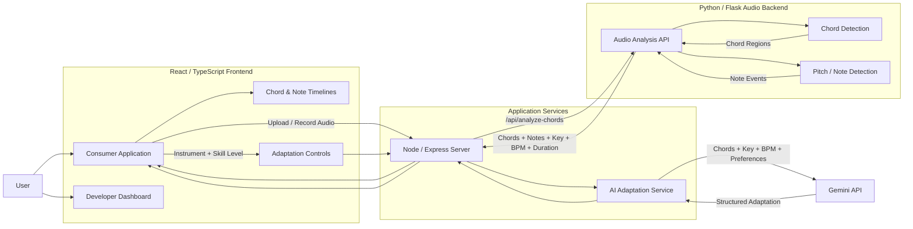
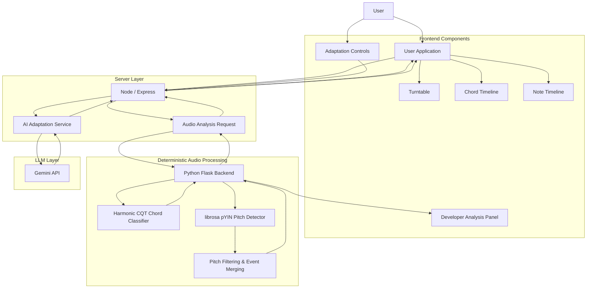
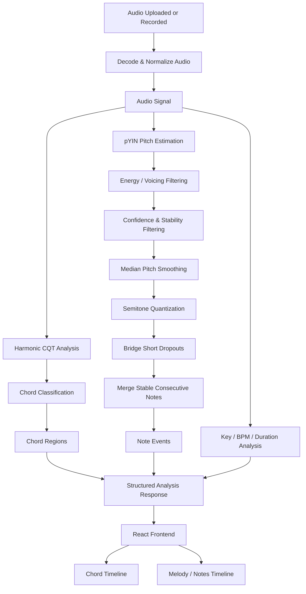
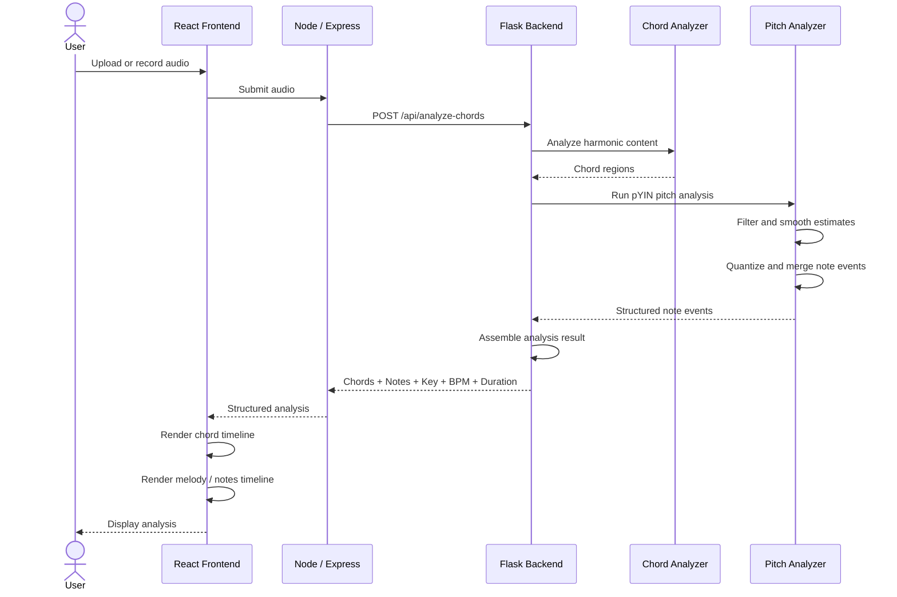
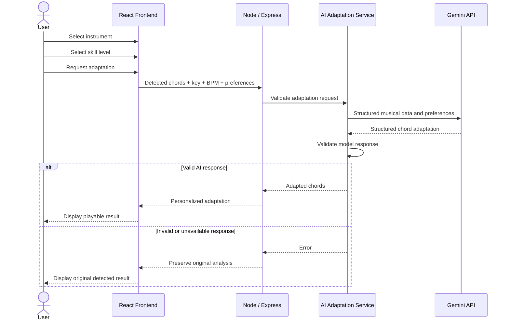
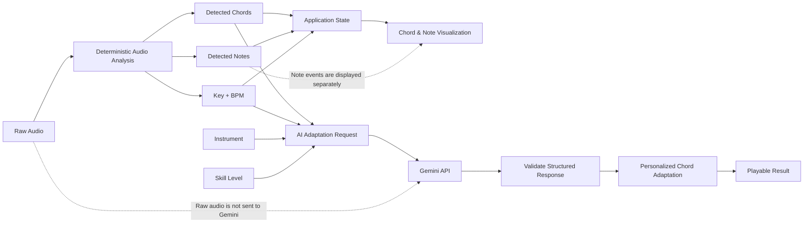

# SonicArc 🎵

SonicArc is a MusicTech web application that analyzes audio and transforms detected musical information into a playable, personalized experience.

A user can upload or record audio, analyze its harmony and melody, view detected chords and notes over time, and request an AI-powered chord adaptation based on instrument and skill level.

The system combines deterministic digital signal processing with an LLM-based adaptation layer.

---

## Core Features

### Audio Analysis

SonicArc analyzes uploaded or recorded audio and extracts:

- Chord progression
- Chord timestamps
- Chord confidence
- Melody / dominant pitch notes
- Note timestamps and duration
- Note confidence
- Musical key
- BPM
- Audio duration

### Chord Detection

Chord detection is performed using deterministic signal processing.

The harmonic analysis uses chroma / CQT-based musical features to classify chord regions throughout the audio.

The LLM is **not** responsible for detecting chords.

### Melody / Note Detection

SonicArc also performs deterministic dominant-pitch detection using `librosa` and the pYIN algorithm.

The pitch-analysis pipeline:

1. Estimates fundamental frequency over time.
2. Rejects silence and low-energy regions.
3. Filters low-confidence or unstable pitch estimates.
4. Smooths pitch values.
5. Quantizes frequencies into musical notes.
6. Bridges isolated short gaps.
7. Merges consecutive stable pitches.
8. Produces structured note events.

Each note event can contain:

- Note name
- MIDI number
- Frequency
- Start time
- End time
- Confidence

The current pitch detector is designed primarily for dominant melodic lines. Dense polyphony, overlapping voices, or melody buried beneath accompaniment may reduce accuracy.

---

## AI Chord Adaptation

After the deterministic analysis is complete, the user can choose:

- Instrument: Guitar or Piano
- Skill level: Beginner, Intermediate, or Advanced

SonicArc then uses the Gemini API to adapt the detected chord progression into a more playable version for that user.

The AI adaptation receives structured musical information rather than raw audio.

The adaptation request contains information such as:

- Detected chords
- Detected key
- BPM
- Selected instrument
- Selected skill level

Gemini can return:

- Original chord
- Adapted chord
- Reason for the adaptation
- Optional transposition
- Optional capo recommendation
- Short adaptation summary

The server validates the structured AI response before returning it to the frontend.

If the AI response is invalid or unavailable, SonicArc keeps the original detected analysis unchanged rather than displaying simulated AI results.

---

## Why SonicArc Uses an LLM

SonicArc intentionally separates tasks that require deterministic signal processing from tasks that benefit from contextual reasoning.

Audio recognition is handled by signal-processing algorithms because chord and pitch detection depend on measurable acoustic features.

The LLM is used for musical adaptation and personalization.

This architecture allows the application to use real audio analysis while still benefiting from an LLM for decisions such as simplifying difficult chords, adapting a progression for a specific instrument, or making the result more appropriate for the user's skill level.

---

## Technology Stack

### Frontend

- React
- TypeScript
- Vite
- Tailwind CSS

### Application Server

- Node.js
- Express
- TypeScript

### Audio Analysis Backend

- Python
- Flask
- librosa
- NumPy

### AI

- Google Gemini API
- Gemini 3.6 Flash

---

## Application Structure

SonicArc contains two main interfaces.

### Consumer Application

Route:

```text
/
```

The consumer interface allows users to:

- Upload or record audio
- Run audio analysis
- View detected chord progression
- View melody / note events
- Inspect timestamps and confidence
- Choose an instrument
- Choose a skill level
- Request AI chord adaptation
- View a personalized playable result

### Developer Dashboard

Route:

```text
/dev
```

The developer interface exposes additional analysis and diagnostic information useful during development and testing.

---

## Main API Flow

### Audio Analysis

```text
POST /api/analyze-chords
```

The audio-analysis endpoint accepts audio as multipart form data.

It performs deterministic audio analysis and returns structured information including:

- Chords
- Notes
- Key
- BPM
- Duration
- Analysis method information

### AI Adaptation

The adaptation service receives the detected musical information together with the user's instrument and skill-level preferences.

The server communicates with the Gemini API using the server-side `GEMINI_API_KEY`.

The API key must never be exposed in frontend code or committed to the repository.

---

# System Design Diagrams

## 1. System Architecture



---

## 2. Component Diagram



---

## 3. Audio Analysis Flow



---

## 4. Audio Analysis Sequence Diagram



---

## 5. LLM Chord Adaptation Sequence Diagram



---

## 6. LLM Data Flow



---

## Design Principle

SonicArc uses two different computational approaches for two different problems:

```text
Audio
↓
Deterministic Signal Processing
↓
Chords + Notes + Key + BPM
↓
────────────────────────────
↓
Gemini LLM
↓
Personalized Chord Adaptation
↓
Playable Result
```

Raw audio is not sent to Gemini for chord or note recognition.

This separation makes the analysis reproducible and keeps the LLM focused on contextual musical adaptation rather than pretending that generative AI is an audio-analysis algorithm.

---

## Running the Project

### Frontend / Application Server

From the project root:

```bash
npm install
npm run dev -- --host 0.0.0.0
```

### Python Audio Backend

From the backend directory:

```bash
cd backend
python app.py
```

The Flask backend runs on port `5000`.

The Vite development server runs on port `3000` and proxies analysis requests to the backend.

---

## Environment Variables

Create a local `.env` file containing:

```text
GEMINI_API_KEY=your_api_key_here
```

Never commit the `.env` file or expose the Gemini API key in frontend code.

## Deploying on Render

The repository includes a Render Blueprint that creates both required services:

- `sonicarc`: the production Node/Express server, which serves the built React app and the Node API routes.
- `sonicarc-audio-backend`: the Gunicorn-hosted Flask service for deterministic audio analysis.

To deploy:

1. Push the repository to GitHub.
2. In Render, create a new **Blueprint** and select the repository.
3. Enter `GEMINI_API_KEY` when Render prompts for the `sonicarc-secrets` environment group.
4. Apply the Blueprint.

Render supplies `PORT` automatically and connects the Node service to Flask through the generated `FLASK_BACKEND_URL`. The browser continues to use the existing same-origin `/api/...` routes, so no frontend configuration or cross-origin setup is required.

---

## Testing

The project includes tests for audio analysis and application behavior.

Backend tests include cases for:

- Single clean notes
- Scales
- Melody over accompaniment
- Silence
- Deterministic noise
- Chord-analysis regression
- API response structure

Run the backend test suite with:

```bash
python -m pytest backend/tests -q
```

Run the JavaScript test suite with:

```bash
npm test
```

---

## Current Limitations

Pitch detection is designed for dominant melodic pitch and may be less reliable when:

- Several instruments play simultaneously
- Multiple voices overlap
- The melody is quiet compared with the accompaniment
- The source contains strongly inharmonic sounds
- The pitch falls outside the supported analysis range

These limitations do not change the existing chord-detection pipeline.

---

## Summary

SonicArc combines real audio analysis with LLM-powered musical personalization.

Instead of asking an LLM to guess what exists inside an audio signal, SonicArc first extracts measurable musical information using deterministic DSP algorithms. Gemini is then used to reason about that structured information and adapt the chord progression to the user's instrument and playing level.

The result is a system that connects audio analysis, music theory, and generative AI in a single playable workflow.

