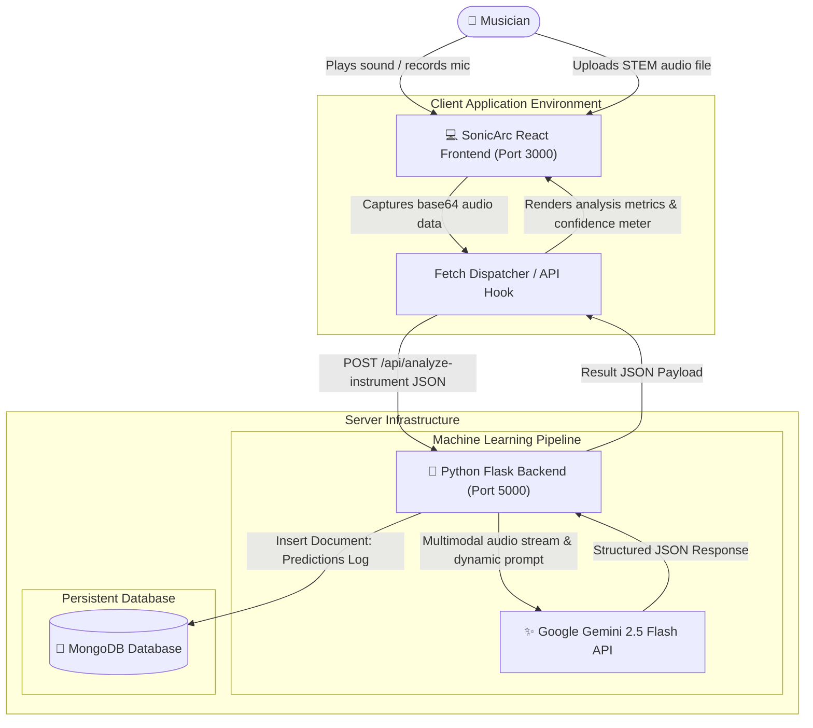
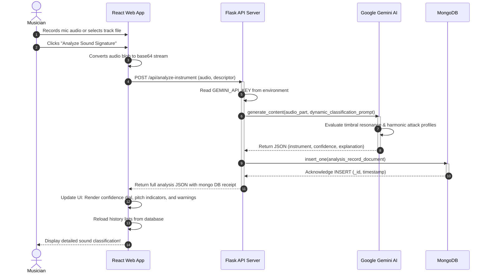

# SonicArc 🎸🎹🎻💨

SonicArc is a professional full-stack musical tool that analyzes raw acoustic wave signals in real-time to identify musical instruments using SOTA Artificial Intelligence, keeping a durable query log and transaction ledger in MongoDB.

---

## 🛠️ Technologies Used

- **Frontend Core:** [React (Vite + TypeScript)](https://react.dev/) – Fast interactive user interfaces with beautiful, responsive Bento-grid views.
- **Styling:** [Tailwind CSS](https://tailwindcss.com/) – Custom typography, dark sleek palettes, and professional negative-space rhythm layouts.
- **Iconography:** [Lucide React](https://lucide.dev/) – Beautiful, consistent interface indicators.
- **Backend API:** [Python Flask](https://flask.palletsprojects.com/) – Lightweight controller implementing CORS headers, base64/multimodal file stream ingestion.
- **Cloud AI Model:** [Google Gemini 2.5 Flash](https://ai.google.dev/gemini-api) – Powering sound-signature classification using the modern official `google-genai` SDK.
- **Database Logs Storage:** [MongoDB Collection](https://www.mongodb.com/) – Using `pymongo` connectors to save prediction history documents containing acoustic properties, confidence ratios, and custom notes.

---

## 🔌 API Endpoints Explanation

### 1. `POST /api/analyze-instrument`
Analyzes an incoming audio stream or user-supplied description to determine the origin instrument.

* **Payload Format:** JSON
  ```json
  {
    "audioData": "base64_encoded_audio_bytes_data",
    "mimeType": "audio/wav",
    "description": "User custom notes about the timbre (optional)"
  }
  ```
* **Response Schema:** Validated structured JSON
  ```json
  {
    "_id": "mongo_inserted_record_hash_id",
    "instrument": "Grand Piano",
    "confidence": 0.95,
    "explanation": "Spotted hammer struck strings producing pristine linear sustain with subtle damper release...",
    "pitch_range": "Soprano / Bass",
    "characteristics": ["Hammer strike transients", "Rich multi-string resonances"],
    "description_prompt": "Optional audio description notes",
    "mime_type": "audio/wav",
    "timestamp": "2026-06-17T10:46:41.000Z",
    "mongodb_logged": true,
    "gemini_processed": true
  }
  ```

### 2. `GET /api/analyses`
Retrieves the logged execution history of analyzed instruments directly from the MongoDB collection.
* **Response Format:** A JSON array of historical prediction documents sorted chronologically (latest first).

---

## 📐 Architecture Diagrams

### 1. System Design Diagram (Mermaid)

The System Diagram details the topology of elements, database stores, machine learning components, and active communication paths:



#### Explanation of System Diagram:
1. **Musician Ingest**: The user interacts with SonicArc by plucking notes, recording audio strings through the microphone, or uploading files.
2. **React Client Ingestion & Encoding**: The frontend captures the media streams, encodes them to base64 waveforms, and packages them alongside user notes into structured API payloads.
3. **Flask Server Processor**: The pythonic Flask service listens to digest streams. On requests, it initializes the `google-genai` client, uses the standard system configuration secrets, and constructs the dynamic prompt asking Gemini to process the signal.
4. **Multimodal AI Solver**: The supported **Gemini 2.5 Flash** model reads the audio content directly, executing timbre sound-signature queries to decipher the instrument, harmonic attack profiles, and confidence ratios.
5. **Durable MongoDB Ledger**: Analysis logs are saved as persistent BSON documents inside MongoDB so musicians can retrieve their historical transactions anytime.

---

### 2. Sequence Workflow Diagram (Mermaid)

The Sequence Diagram details the chronological order of execution calls:



#### Explanation of Sequence Diagram:
1. The musician initiates the action flow on the React UI by recording audio.
2. The user executes the analysis button which converts waves into active strings.
3. An HTTP POST request containing base64 audio hits `/api/analyze-instrument` on the backend.
4. The backend initializes Gemini safely, constructing a prompt mapping harmonic spectral peaks and requesting valid double-quoted JSON.
5. SOTA Gemini API processes multi-sensory audio signals, formulating the response containing instrument categories and explanations.
6. The compiled results are saved with accurate UTC timestamps as structured history documents inside the MongoDB cluster.
7. Under exact schemas, the Flask controller answers the client with high-fidelity output.
8. The React client animates meters, displays explanations, and syncs history.

---

## 🔑 How to Run the Project

### 1. Configure Secrets & Environments
Define variables in your `.env` configuration file:
```env
GEMINI_API_KEY="AI_STUDIO_SECRET_KEY"
MONGO_URI="mongodb://localhost:27017/"
MONGO_DB_NAME="sonicarc_db"
```

### 2. Run the Flask Backend
```bash
cd backend
pip install -r requirements.txt
python app.py
```

### 3. Start the React Frontend Sandbox
```bash
npm install
npm run dev
```
Navigate to `http://localhost:3000` to start classifying sound profiles.

## Chord detection

The Studio Control Desk sends dropped or selected audio to the existing Flask
backend at `POST /api/analyze-chords`. The endpoint accepts multipart form data
under `file`, or JSON containing `audioData`, `mimeType`, and optionally
`filename`. A successful response contains the detected key, optional BPM,
duration, and chronological chord regions:

```json
{
  "filename": "progression.wav",
  "mime_type": "audio/wav",
  "analysis": {
    "key": "C Major",
    "key_confidence": 0.42,
    "bpm": 120.0,
    "bpm_confidence": 0.61,
    "duration": 8.0,
    "chords": [
      {"chord": "C Major", "start": 0.0, "end": 2.0, "confidence": 0.73}
    ],
    "method": "harmonic-cqt-template-v1"
  }
}
```

Install and run both processes locally:

```bash
python -m pip install -r backend/requirements.txt
python backend/app.py
# In another terminal:
npm install
npm run dev
```

Test an audio file directly (the frontend dev server proxies `/api` to Flask):

```bash
curl -F "file=@/absolute/path/to/audio.wav" http://localhost:5000/api/analyze-chords
python -m pytest backend/tests
```

`librosa` supplies harmonic/percussive separation, constant-Q chroma, onset,
and beat features; `soundfile` provides reliable WAV/FLAC decoding. Compressed
formats may additionally require the system FFmpeg decoder. The current
detector recognizes major and minor triads plus `N` (no reliable chord). It
does not yet distinguish inversions, seventh/extended chords, or slash chords.
Dense arrangements, tuning drift, fast changes, and half/double-tempo ambiguity
can reduce accuracy. Unreliable tempo is returned as `null`, and invalid,
silent, or harmonically inconclusive audio returns an error rather than a
fabricated progression.

## AI chord adaptation

After chord detection completes, the browser can send its structured result to
`POST /api/adapt-chords`. This Node/Express endpoint calls Google Gemini 2.5
Flash on the server; `GEMINI_API_KEY` is read only from the server environment
and is never included in the frontend bundle. No audio is sent to this endpoint.

```json
{
  "instrument": "guitar",
  "skillLevel": "beginner",
  "detectedChords": [{ "chord": "Dm7", "start": 0, "end": 2.4 }],
  "detectedKey": "C Major",
  "bpm": 108
}
```

The response contains `adaptedChords` entries with `original`, `adapted`, and
`reason`, plus nullable `transposeTo` and `capo` fields and a short `summary`.
The server validates both input and model output, including an exact positional
match between every detected chord and every returned `original`. Invalid or
unavailable AI output produces an error and the UI keeps the detected analysis
unchanged rather than displaying a simulated adaptation.
